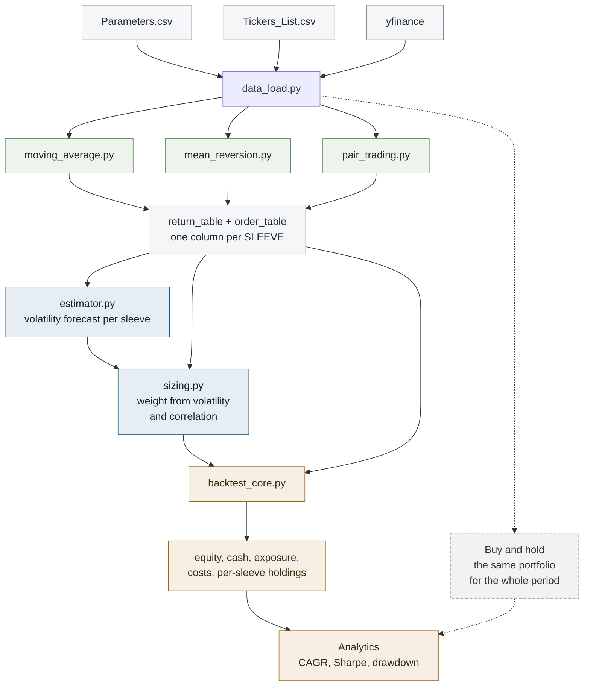

# Vol-Targeted Backtester

A multi-strategy equity backtester with a volatility-targeting risk layer. Signals decide
*direction*; the risk layer decides *size*; the engine keeps the books. Each of the three can
be replaced without touching the other two.

Daily bars from `yfinance`. Python 3.13, pandas 3, numpy 2, statsmodels, `arch`.

> Repo name candidates, if you prefer another: `vol-targeted-backtester`, `sigma-engine`,
> `voltarget`, `scaled-book`.

---

## Workflow

The question this project exists to answer: **does sizing positions by forecast volatility
improve a multi-strategy book, or only reshape its tails?**

The method, in order:

1. **Signal** — each strategy says long, short or flat, every day.
2. **Forecast** — estimate how volatile each sleeve will be tomorrow.
3. **Size** — each sleeve gets a weight based on its volatility and its correlation with the
   others. A volatile sleeve gets less; a sleeve that hedges the rest gets more.
4. **Trade** — only move a position if the change is worth the commission. Exits and reversals
   always go through.
5. **Account** — compound the book day by day and charge the costs.
6. **Measure** — CAGR, Sharpe, drawdown.

Every run is measured against a baseline: buying the same portfolio on day one and holding it
for the whole period. Volatility targeting is only worth its turnover if it beats that.

---

## Architecture



The dashed branch is the baseline. Everything else is the strategy path.

```
Backtester/
  Data/        data_load.py  Parameters.csv  Tickers_List.csv
  Strategy/    moving_average.py  mean_reversion.py  pair_trading.py
  Risk/        estimator.py  sizing.py
  Engine/      backtest_core.py
  Analytics/   ret.py  sharpe_ratio.py  maximum_drawdown.py
  Main/        main.ipynb
```

`Main/main.ipynb` assembles the sleeve tables into three aligned frames — `return_table`,
`order_table`, `weight` — **one column per sleeve, not per ticker**. A pair is one column.

---

## Input

Everything the run needs is in two CSVs. No code changes to test a different universe.

### `Data/Tickers_List.csv`

Three columns, one row per ticker.

| Column | Meaning |
|--------|---------|
| `ticker` | Any symbol `yfinance` accepts. |
| `weight` | Share of capital for that sleeve, held constant for the whole period. Any positive scale — normalised to sum to 1. |
| `strategy` | One of `MA`, `ME`, `PT`. Nothing else is accepted. |

`PT` rows must come in **consecutive pairs** — row *n* is leg 1, row *n+1* is leg 2 of the same
pair. Two `PT` rows make one sleeve, not two.

### `Data/Parameters.csv`

Two columns, `Parameter,Value`, one setting per row. Order does not matter; names do.

**Window and capital**

| Parameter | Format |
|-----------|--------|
| `start_year` `start_month` `start_day` | integers |
| `end_year` `end_month` `end_day` | integers, exclusive |
| `interval` | `1d`, `1wk`, `1mo` |
| `start_balance` | positive number |
| `commission` | decimal |
| `risk_free` | annual rate, decimal |

**Signals**

| Parameter | Applies to | Format |
|-----------|-----------|--------|
| `fast_ma`, `slow_ma` | `MA` | integers, `fast_ma < slow_ma` |
| `upper_me`, `lower_me` | `ME` | z-score entry thresholds. `lower_me` negative |
| `equal_me` | `ME` | exit band, positive. Flat when \|z\| < `equal_me` |
| `stop_me` | `ME` | stop-out level, positive, greater than `upper_me` |
| `upper_pt`, `lower_pt`, `equal_pt`, `stop_pt` | `PT` | same meanings, on the spread's z-score |

**Risk layer**

| Parameter | Format | Notes |
|-----------|--------|-------|
| `vol_model` | `std`, `weighted_std`, `RS`, `YZ`, `garch` | **exact strings, case-sensitive** |
| `window` | integer, days | lookback for `std`, `RS`, `YZ`, and for the pair OLS |
| `window_garch` | integer, days | fitting sample for `garch`. 500 minimum in practice |
| `lambda_wstd` | 0 to 1 | decay for `weighted_std`. `0.94` = RiskMetrics daily |
| `refit` | integer, days | how often `garch` and the pair OLS refit |
| `target_vol` | annual, decimal | `0.10` = 10% |
| `cap` | positive number | maximum leverage. `1.5` |
| `band` | positive number, in weight units | no-trade band. `0.1` |

**`RS` and `YZ` require OHLC, so they cannot run on a `PT` sleeve** — a spread has no high or
low, and building one from the legs overstates the range by roughly 3.7×. Pair sleeves must use
`std`, `weighted_std` or `garch`.

---

## Strategies

| Code | Module | Rule |
|------|--------|------|
| `MA` | `moving_average.py` | Long while `SMA(fast) > SMA(slow)`, flat otherwise. Long-only — never shorts. |
| `ME` | `mean_reversion.py` | Rolling z-score of price. Short above `upper`, long below `lower`, flat inside `±equal`, stopped out beyond `stop`. |
| `PT` | `pair_trading.py` | Rolling OLS hedge ratio between two names, z-score on the spread, same state machine as `ME`. |

All three share one state machine: enter on a threshold cross, exit on reversion toward the
mean, flatten on a stop. The stop is evaluated **after** the entry logic and overrides it, so a
signal beyond `stop` never opens a position — the effective entry region is a *band*, e.g.
`2 ≤ |z| < 3`, not a threshold.

---

## Risk layer

### Volatility estimators — `Risk/estimator.py`

| `vol_model` | Function | Input | Notes |
|-------------|----------|-------|-------|
| `std` | `rollingStd` | returns | Rolling standard deviation. The baseline everything is compared against. |
| `weighted_std` | `weightedRollingStd` | returns | EWMA / RiskMetrics. Half-life ≈ 13 days at `lambda = 0.94`. |
| `garch` | `garchVol` | returns | GARCH(1,1), refit every `refit` days. A one-day-ahead *conditional* forecast, not a trailing average. |
| `RS` | `volRogerSatchell` | OHLC | Rogers-Satchell. Intraday only — **excludes the overnight gap**, so it understates the risk of an overnight holder. |
| `YZ` | `volYangZhang` | OHLC | Yang-Zhang: overnight + open-to-close + Rogers-Satchell. The efficient choice when you do hold overnight. |

All are annualised by `sqrt(252)`.

An estimator's standard error is roughly `1/sqrt(2n)` — about 9% of the estimate at `n = 63`.
That figure is what the no-trade band exists to absorb: do not pay commission to chase a change
smaller than your ability to measure it.

### Sizing — `Risk/sizing.py`

Each sleeve's raw weight is its direction divided by its forecast volatility, then normalised so
the book is exactly one times gross:

$$
\tilde{w}_i = \frac{s_i}{\hat{\sigma}_i}
\qquad\qquad
w_i = \frac{\tilde{w}_i}{\sum_j |\tilde{w}_j|}
$$

That book's forecast volatility uses the volatilities on the diagonal and the correlations off it:

$$
\sigma_p = \sqrt{\mathbf{w}^{\top} D\,C\,D\,\mathbf{w}}
\qquad
D = \mathrm{diag}(\hat{\sigma}_1, \dots, \hat{\sigma}_n)
$$

One leverage factor then scales the whole book onto the target:

$$
L = \mathrm{clip}\!\left(\frac{\sigma_{\mathrm{target}}}{\sigma_p},\; -\mathrm{cap},\; \mathrm{cap}\right)
\qquad\qquad
\mathbf{w}^{\mathrm{final}} = L \cdot \mathbf{w}
$$

where $s_i \in \{-1, 0, +1\}$ is the order and $\hat{\sigma}_i$ the volatility forecast.

`C` is the **correlation** matrix, not covariance — the volatilities enter through `D`, and
passing covariance instead double-counts them. The correlation is refit every `refit` days on a
`window` sample.

---

## Conventions

Six rules the system depends on. Breaking any one produces wrong numbers with no error message.

**Indexing.** Row `t` holds the value that became known at the **close of day `t`**. Estimators,
orders and weights all obey this. The engine holds the one and only `shift`: a weight set at the
close of `t` earns the return of `t+1`.

**Direction lives in the weight.** `weight` is signed; shorts are negative. `order_table` feeds
sizing and validation only — it never reaches the P&L.

**Returns are simple in the engine, log in the estimators.** A ledger compounds `1 + r`; a
variance is estimated from `log(1 + r)`. Feeding log returns to the engine applies variance drag
a second time — about −2%/year at 20% volatility.

**Costs** are charged on `|Δw|` at the close where the trade happens, scaled by the balance:
`cost = balance * turnover * commission`.

**Cash may be negative.** `cash = balance * (1 - leverage)`. Above 1× leverage that number is
negative and correct — it is the margin loan. Clamping it at zero breaks the identity below and
mints money on every levered day.

**The ledger identity.** This must hold on every row, to exactly 0.0:

```
Balance = Cash + Held - Transaction
```

---

## Example run

Illustrative output of this engine, not a research finding.

**Universe** — TSLA, AAPL, AMZN (`MA`) · XLU, XLF (`ME`) · KO / PEP (`PT`),
weights 7,7,7,5,5,3,3.

**Settings** — 2018-01-01 to 2023-01-01, `start_balance` 1,000,000, `commission` 0.001,
`vol_model` garch, `window` 63, `window_garch` 500, `refit` 21, `target_vol` 0.10,
`cap` 1.5, `band` 0.1, `risk_free` 0.04.

| | Vol-targeted | Buy & hold |
|---|---:|---:|
| Period covered | 2020-04 → 2022-12 | 2018-01 → 2022-12 |
| Years | 2.75 | 4.99 |
| Total return | 43.0% | 163.2% |
| CAGR | 13.90% | 21.40% |
| Sharpe | 1.01 | 0.61 |
| Max drawdown | **−8.1%** | −55.1% |
| Longest drawdown | 121 days | 250 days |
| Total cost | 65,463 | — |
| Largest single day's cost | 1,548 | — |

**The risk layer hit its target.** Backing volatility out of the CAGR and the Sharpe gives a
realised **10.4%** against a 10.0% target — within 4%. That is the primary thing this project
set out to test, and it worked.

**And it reshaped the tails, hard.** A −8.1% maximum drawdown against −55.1%, and 121 days
underwater against 250. The strategy gave up a third of the CAGR and removed six sevenths of the
drawdown.

**The two columns do not cover the same period.** `start = window_garch + window = 563` trading
days, so the strategy is only live from April 2020. The return comparison is indicative, not
conclusive.

**Neither Sharpe is significant on its own.** `SE(Sharpe) ≈ 1/sqrt(years)` — 0.60 for the
strategy, 0.45 for the baseline. A 1.01 with a 0.60 error bar is encouraging, not proven.

**Costs are real and large.** 65,463 is **2.4% of capital per year** at 10 bp — roughly **20
units of turnover a year**, so gross CAGR is near 16.3% against 13.90% net. Turnover is the
first thing to attack.

---

## Limitations

- **No financing cost.** Negative cash is tracked but charged no interest, and shorts pay no
  borrow fee. Levered and short-heavy results are optimistic.
- **Basic strategies.** Textbook forms with no filters and no parameter search. They exist to
  give the risk layer something to size, not as an edge in themselves.
- **Orders carry no conviction.** `LONG / SHORT / EXIT` only — a z-score of 2.0 and one of 2.9
  give the identical `+1`. All variation in size comes from the risk layer. Fills at the close.
- **No concentration limit.** Volatility targeting equalises volatility, not idiosyncratic risk.
  A single low-volatility sleeve can take a very large share of capital.
- **Close prices only.** Signals, returns and P&L never see the open, high or low — no intraday
  information, no gap modelling, and every trade priced at the close. The `RS` and `YZ`
  estimators are the sole exception, and neither is used in the run above.
- **Survivorship.** The universe is chosen today, so delisted names are absent.
